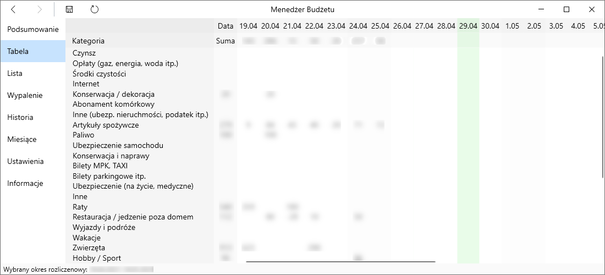

# Budget Manager

Aplikacja umożliwiająca zapisywanie codziennych wydatków i wyświetlanie statystyk.

## TODO

- Dostosowanie widoków
  - Wypalenie
    - zaznaczone weekendy
  - Raport
- Porządkowanie danych
  - W przypadku daty spoza zakresu przenoszenie wydatków do właściwego okresu rozliczeniowego
    - Jeśli okresu brak, pytanie o zmianę daty lub usunięcie
  - Usuwanie nieużywanych kategorii
