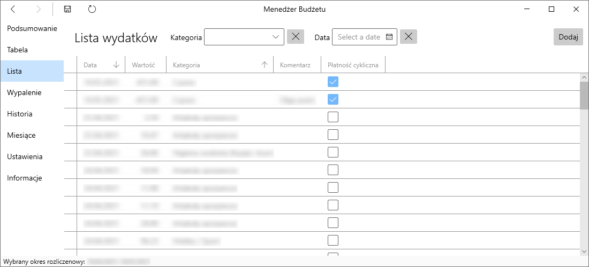
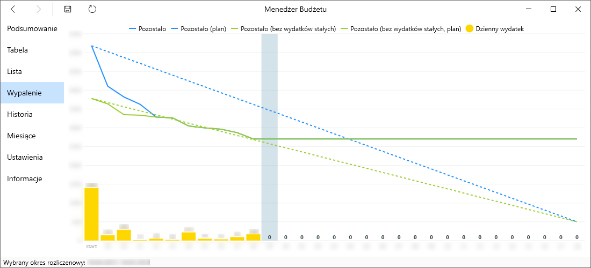
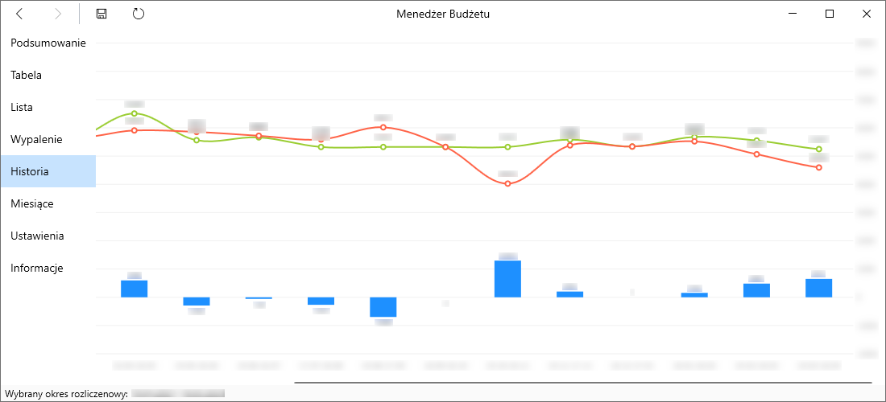

# Budget Manager

Aplikacja umożliwiająca zapisywanie codziennych wydatków i wyświetlanie statystyk.

## Funkcje

- Kontrola wykorzystania planowanego miesięcznego budżetu
- Dodawanie wydatków w danej kategorii
- Oznaczanie wydatków jako wydatki stałe
- Ustalanie dochodu netto i dochodu dodatkowego
- Ustalanie planowanych oszczędności w miesiącu
- Wyświetlanie szacowanego dziennego limitu wydatków
- Dostosowywanie początku i końca miesiąca (okresu rozliczeniowego)

### Podsumowanie wydatków

Informacje o całym miesiącu, sumy wydatków i dochodów, planowane oszczędności, bilans, sugerowany dzienny wydatek, by nie wyjść poza zakładany budżet.

### Tabela wydatków

Sumy wydatków w danej kategorii i w danym dniu, z możliwością przejścia do listy wydatków.

### Lista wydatków

Lista wydatków z możliwością filtrowania dla konkretnej kategorii lub dnia.

### Wykres wypalenia

Znany w biznesie "burndown chart" pokazujący, ile funduszy zostało w miesiącu.

### Historia wydatków

Podsumowanie przychodów, wydatków i bilansu na przestrzeni wszystkich wpisanych miesięcy.

## TODO

- Cofnij/powtórz wykonaną operację
- Dostosowanie widoków
  - Tabela wydatków
    - automatyczne przewinięcie do aktualnego dnia
  - Wypalenie
    - zaznaczone weekendy
  - Raport
- Sortowanie / zmiana kolejności kategorii
- Najczęściej używane kategorie na górze listy rozwijanej
- Serializacja danych do JSONa celem wyeliminowania problemu ze zmianą struktury zapisywanych danych
- Porządkowanie danych
  - W przypadku daty spoza zakresu przenoszenie wydatków do właściwego okresu rozliczeniowego
    - Jeśli okresu brak, pytanie o zmianę daty lub usunięcie
  - Usuwanie nieużywanych kategorii